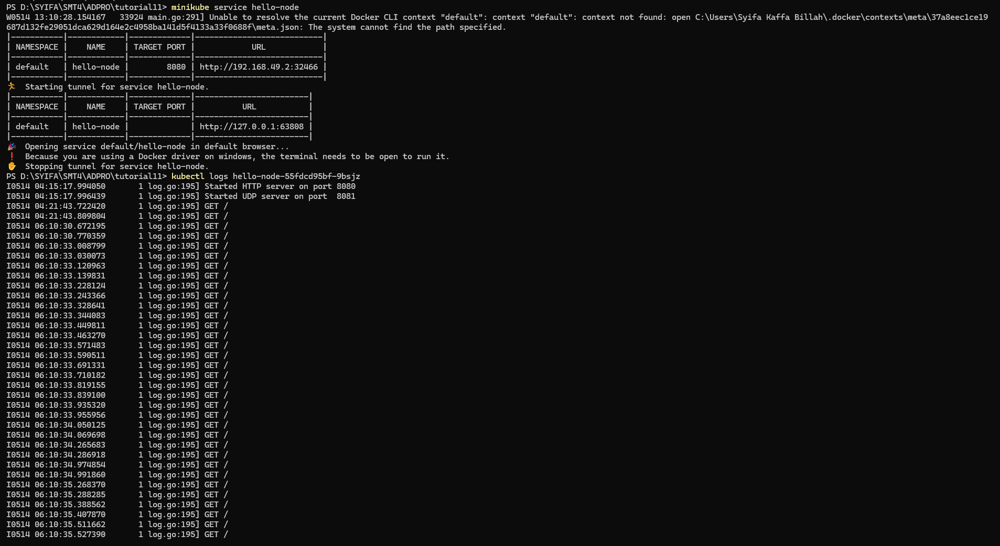
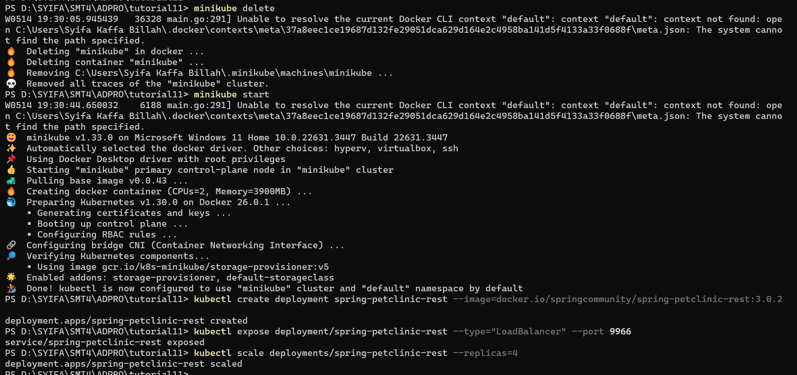
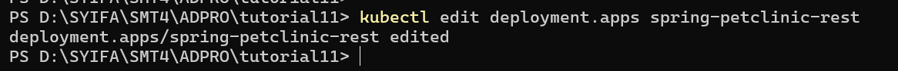
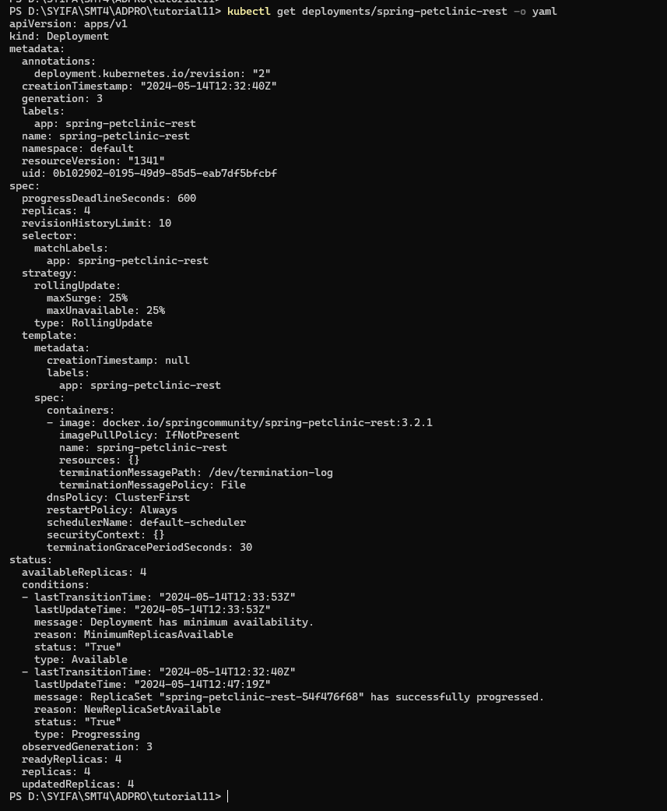
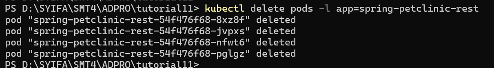
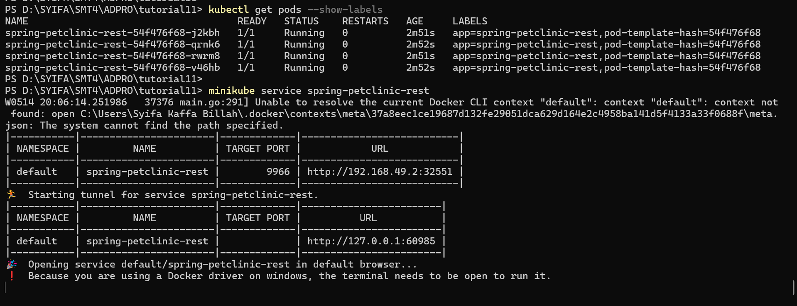
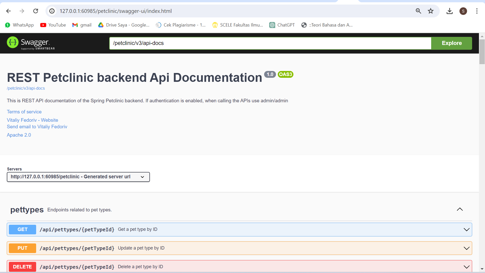
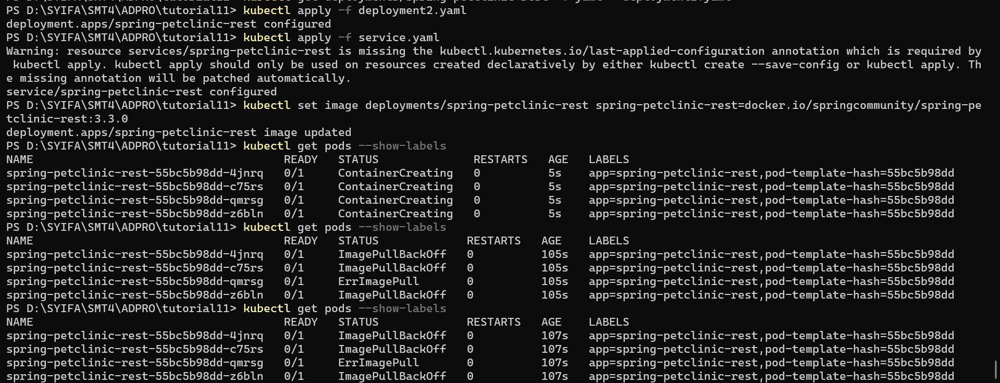
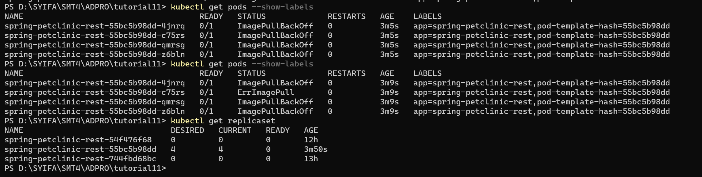

## Tutorial 11 - Deployment on Kubernetes
Nama: Syifa Kaffa Billah

NPM: 2206816430

Kelas: C


### Reflection on Hello Minikube

1. **Compare the application logs before and after you exposed it as a Service. Try to open the app several times while the proxy into the Service is running. What do you see in the logs? Does the number of logs increase each time you open the app?**

    

    Ya, terdapat perbedaan sebelum dan sesudah servicenya di exposed. Setelah di exposed, service menjadi bisa menerima request sehingga log akan mencatat permintaan yang telah dilakukan, misalnya seperti yang tertera pada gambar yang mana service mengirim requst /GET berkali kali jika di-refresh berkali-kali terhadap layanan hello-node.

2. **Notice that there are two versions of `kubectl get` invocation during this tutorial section. The first does not have any option, while the latter has `-n` option with value set to `kube-system`. What is the purpose of the `-n` option and why did the output not list the pods/services that you explicitly created?**

    Perbedaan antara kedua sintaks tersebut adalah dengan menggunakan `-n`, kita menyatakan bahwa service yang kita inginkan berasal dari namespace. Ini diperlukan misalnya jika ada banyak service yang berbeda yang memiliki nama yang sama dan tersebar di banyak namespace. Dengan menggunakan `-n`, kita memfokuskan GET pada namespace yang kita berikan setelah query `-n`.


### Reflection on Rolling Update & Kubernetes Manifest File
1. **What is the difference between Rolling Update and Recreate deployment strategy?**

    Perbedaan utama antara strategi rolling update dan recreate deployment adalah dalam recreate deployment akan terjadi downtime antara pembaruan aplikasi karena strategi ini memerlukan penghapusan aplikasi sebelumnya dan kemudian melakukan redeploying aplikasi yang baru. Oleh karena itu, akan terjadi downtime setelah penghapusan dan selesai deployment. Berbeda dengan rolling update yang mengubah aplikasi secara bertahap ke versi terbarunya. Dengan kata lain, rolling update dapat memperbarui aplikasi secara bertahap tanpa adanya downtime yang signifikan.

2. **Try deploying the Spring Petclinic REST using Recreate deployment strategy and document your attempt. Reference: https://dev.to/cloudskills/kubernetes-deployment-strategy-recreate-3kgn**

    Pertama, saya akan membuat ulang springboot-petclinic-rest yang telah ditingkatkan ke versi 3.0.2

    

    Setelah itu saya memanfaatkan sifat replikaset yang akan menggantikan pod yang dihapus dengan template-nya, sehingga akan menggantikan versi template pada pengaturan berikut.

    

    Make sure bahwa perubahan berhasil diterapkan dengan menjalankan query berikut yang akan menghasilkan output seperti yang ditunjukkan pada gambar.

    

    Menghapus pod
    

    Terlihat bahwa pod baru sedang dibuat untuk menggantikannya.
    

    Ketika dijalankan, akan menampilkan response dan halaman berikut
    


3. **Prepare different manifest files for executing Recreate deployment strategy.**
Sebuah file dapat dibuat seperti yang di push di github dengan nama deployment2.yaml. Isi file sama dengan file ekspor pada tutorial namun terdapat perbedaan pada bagian strategy dan selector.

    ```yaml
            selector:
                matchLabels:
                app: spring-petclinic-rest
            strategy:
                type: Recreate
    ```

    File tersebut dapat diimport ke Kubernetes seperti file manifes lainnya, kemudian setelah itu untuk membuktikan bahwa file manifes ini berguna, kita dapat mengubah gambar yang ada di file tersebut ke versi yang kita inginkan misalny a3.3.0dimana itu akan menghapus pod di set replika lama kita dan kemudian akan mendeploy pod baru di replika baru seperti yang ditunjukkan di bawah ini.

    
    

4. **What do you think are the benefits of using Kubernetes manifest files?**

    Benefits dari menggunakan file manifest Kubernetes yaitu dari segi efisiensi. Kita tidak perlu lagi mengingat prosedur dan sintaks yang perlu dilakukan saat melakukan pembaruan atau implementasi pertama kali. Ini sama seperti saat kita mengimpor file dalam dokumen. Kita tidak perlu tahu bagaimana dokumen tersebut dibuat, yang penting sekarang kita memiliki dokumen yang siap digunakan. Penggunaan file manifest juga mengurangi kemungkinan kesalahan manusia karena dengan file manifest, layanan yang dibuat pasti sesuai dengan isi file dan menghindari kesalahan pengetikan saat mengetikkan sintaks satu per satu.